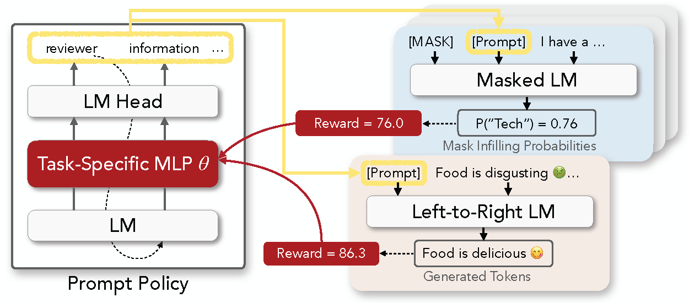

Báo cáo cuối kỳ môn Chuyên đề nghiên cứu về máy học và trí tuệ nhân tạo - CS2310.CH1801
Đại học Công nghệ thông tin


MSHV: Nguyễn Hoa – 220101044
Nguyễn Trung Thu – 230101034

GV: TS. Lương Ngọc Hoàng


T4/2024


# RL Prompt

python run_fsc.py dataset=[sst-2, yelp-2, mr, cr, agnews, sst-5, yelp-5] dataset_seed=[0, 1, 2, 3, 4] prompt_length=[any integer (optional, default:5)] task_lm=[distilroberta-base, roberta-base, roberta-large, distilgpt2, gpt2, gpt2-medium, gpt2-large, gpt2-xl] random_seed=[any integer (optional)]


{'SQL_ON/rewards/acc': tensor(0.5000, device='cuda:0'), 'SQL_ON/rewards/gap_reward_class_0': tensor(-163.1316), 'SQL_ON/rewards/gap_reward_class_1': tensor(188.6110), 'SQL_ON/rewards/gap_reward': tensor(12.7397), 'SQL_ON/rewards/resized_reward': tensor(0.)}

logits.shape==torch.Size([2, 3, 50257])
logits_   --->softmx
[['Price', 'Size', 'Size'], ['Price', 'Product', 'ĠQuantity']]

tensor([-1.0000,  1.0000], device='cuda:0')

tensor(416.1516, device='cuda:0', grad_fn=<MeanBackward1>)


This repo contains the code of the discrete prompt optimization framework described in the paper \
**[RLPrompt: Optimizing Discrete Text Prompts With Reinforcement Learning](https://arxiv.org/abs/2205.12548)** \
Mingkai Deng*,   Jianyu Wang*,   Cheng-Ping Hsieh* (equal contribution),   Yihan Wang,   Han Guo,   Tianmin Shu,   Meng Song,   Eric P. Xing,   Zhiting Hu 

We will keep updating the codebase for easier usage and adaptation for your own tasks, so please stay tuned by starring or watching our repo! 

## Getting Started

* Extensive recent work (e.g., [this](https://arxiv.org/abs/2107.13586)) has shown that *prompting* pre-trained LMs with specific text can steer them to perform various NLP tasks, without needing to update the model
* Previous work has typically tuned soft prompts with gradient-based optimization or searched for discrete text prompts using various heuristics
* In our paper, we propose to formulate discrete prompt optimization as an RL problem, and train a policy network to generate the prompt that optimizes a reward function
* Compared to typical soft prompts, our discrete prompts are lightweight, interpretable, and transferrable across model types (e.g., RoBERTa to GPT-2) and sizes (e.g., small to large)
* Check out more analyses at our paper [here](https://arxiv.org/abs/2205.12548)



## Setting Up

Our codebase requires the following Python and PyTorch versions: 
* Python >= 3.7
* PyTorch >= 1.10.1 (install from the [official website](https://pytorch.org/get-started/locally/))

Install our core modules with
```
pip install -e .
```

## Usage

Please refer to the folders in `examples`, which contains our implementations of 1) [few-shot classification](https://github.com/mingkaid/rl-prompt/tree/main/examples/few-shot-classification) and 2) [text style transfer](https://github.com/mingkaid/rl-prompt/tree/main/examples/text-style-transfer), as described in our paper.  

In short, the code in `rlprompt` provides the core components for prompt optimization. The task-specific folders in `examples` simply implement the reward functions and use the core modules to run experiments.  
